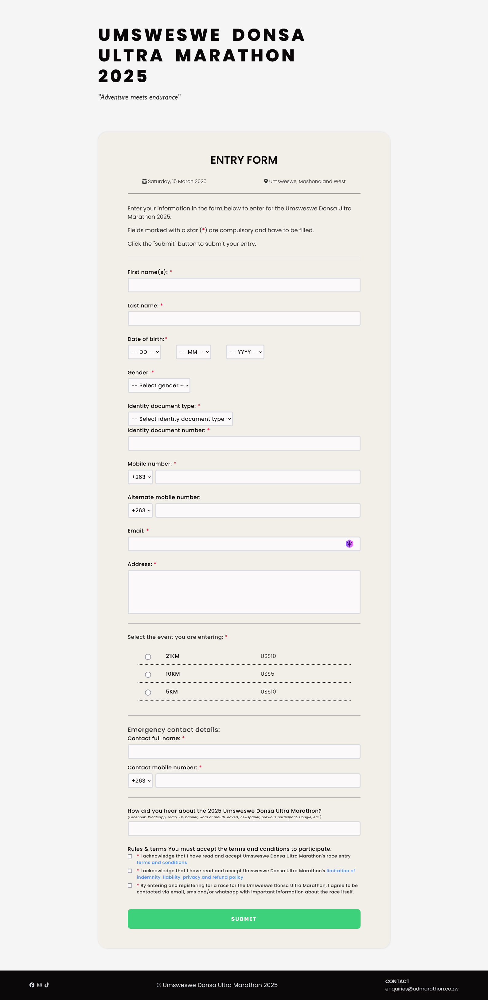

# HTML Form - Full Stack Web App

- HTMl form that accepts and stores user input on successful submission.

- FRONT-END: vanilla HTML, CSS, JavaScript
- BACK-END: NodeJS, ExpressJS, MySQL, EJS

- portfolio project demonstrating my fullstack developer skills with a HTML form that executes create, read & update functions to the database
- registration form that uses nodejs as the server. the form data is first validated client side, then again server side using express-validator
- validated data is stored in a mysql db
- the validated data is also stored in a google sheet with users with the link only able to view
- client side and server side form validation
- form is responisve
- flexbox & grid
- hardcoded options for country-code, year of birth, etc. exponentially increased the length of the html as phone number input with country code is asked 3 times
- using regex in form as client side validation
s